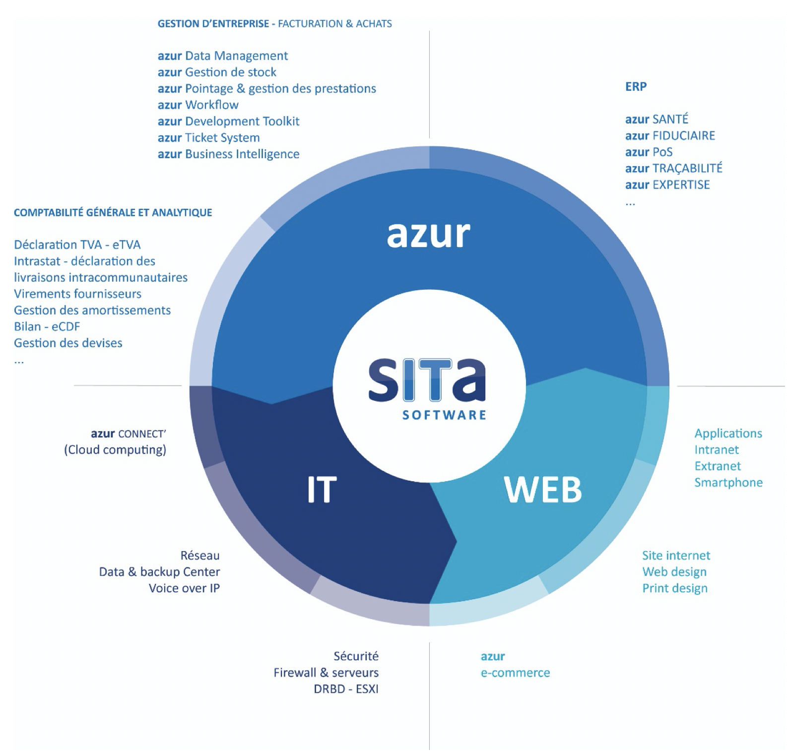

# Introduction

Vous avez choisi azur pour donner à vos travaux de bureautique une autre dimension: celle de traiter les données administratives avec simplicité, confidentialité et surtout rapidité. azur améliore les contacts avec vos clients et fournisseurs, il vous apporte à la fois rigueur et flexibilité dans votre organisation interne ce qui vous permet de libérer du temps tant à la réflexion qu’à la créativité. Nous vous remercions d'avoir choisi azur et vous souhaitons une fructueuse collaboration. L’équipe Sita Software. Azur permet dans un même logiciel de gérer toutes les facettes de l'administration des entreprises.

