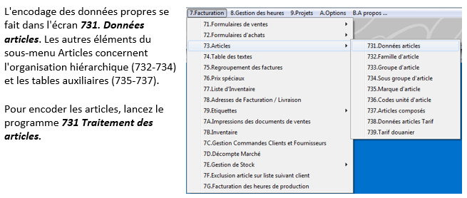

# Azur

### Lancement du programme

#### Login&#x20;

.png>)

#### Mot de passe dossier

.png>)

#### Barre des menus

.png>)

#### Barre des raccourcis

.png>)

Faire un clic droit sur la barre de raccourci et cliquer sur _**Adapter**_ pour passer en mode **Configuration.**

&#x20;

Faire à nouveau un clic droit puis choisir _**Ajouter**_ un raccourci : la liste des menus Azur s’affiche, il vous suffit de choisir un menu pour l’ajouter à la barre des raccourcis.

.png>)

Refaire clic droit pour et décocher l’option _**Adapter**_ pour sortir du mode configuration.

#### Barre des tâches

La barre de tâches s’ouvre et se ferme avec le programme Azur. Si elle se trouve masquée par un autre écran d’azur, il suffit d’appuyer sur la touche _**F9**_ pour la faire appaître.

.png>)

### Les principes de fonctionnement

#### La navigation avec les touches du clavier

A _l’encodage_ :

&#x20;

·         Les cases et boutons importants reçoivent le focus (couleur bleue azur) et l’enchaînement

de saisie est donc prédefini : il s’effectue par la validation, champ après champ, des information encodes avec la touche _**ENTER**_.

&#x20;

·         Au derniere champ d’un formulaire, les focus se déplace sur le bouton par défaut. En general c’est le bouton _**VALIDER**_ et l’encodage est enregistré dans la base de données en appuyant une nouvelle fois sur _**ENTER**_.

&#x20;

·         Se déplacer entre les champs d’entrée : si vous voulez revenir à champ precedent pour changer une valeur, utilisez les touches de direction “**haut**” et “**bas**”. (N’oubliez pas de confirmer les nouvelles veleurs en appuyant sur _**ENTER**_.

&#x20;&#x20;

Il est preferable, au lieu d’appuyer sur _**VALIDER,**_ d’appuyer sur la touche _**F11**_ et au lieu de cliquer sur _**ANNULER,**_ d’utiliser la touche _**F12.**_

#### _**Touches d'actions**_

| **TOUCHES**        | **ACTIONS**                                          |
| ------------------ | ---------------------------------------------------- |
| **F1**             | Appel de la fonction Aide                            |
| **F2**             | Défilement des fenêtres ouvertes                     |
| **F3**             | Ouverture de la fenêtre de recherche                 |
| **F4**             | Appel des textes standard                            |
| **F5**             | Impression de la page courante                       |
| **F6**             | Faire défiler les ordres de tri                      |
| **SHIFT + F6**     | Faire défiler dans le sens inverse les ordres de tri |
| **F7**             | Parcourir les pages des onglets                      |
| **SHIFT + F7**     | Parcourir les pages des onglets en sens inverse      |
| **F9**             | Appel de la barre de contrôle                        |
| **F11**            | Validation                                           |
| **F12**            | Annulation                                           |
| **ALT + Nombre**   | Aller à la page d'onglet numérotée                   |
| **ESC**            | Fermeture des fenêtres                               |
| **END**            | Fermeture d'**azur** Gestion                         |
| **ENTER / Return** | Confirmer la valeur entrée au clavier                |

.png>)

### _**L'écran de recherche - F3**_

Dans certains champs pouvez sélectionner les valeurs à partir d’une liste d’enregistrements.

En general ces champs sont marqués par un bouton avec trois points. Pour appeler la liste,

appuyez sur _**F3**_ quand le courser est positionné sur le champ en question. Cette liste est appellée fenêtre de recherche et se présente sous cette forme:

.png>)

Le contenu de la liste dépend du champ à partir duquel la fenêtre a été lancée, mais elle s'utilise de la même façon. Dans cet exemple on a lancé la fenêtre de recherche à partir du champ **No Client** dans le programme **321 (Données clients).**

### _**La préparation d'un nouveau dossier**_

#### _**La création du dossier**_

Pour créer un nouveau dossier, saisir un nouveau numéro de dossier dans le champ _Dossier_ de la barre de tâches. Le programme vous informe que le numero de dossier n’existe pas et vous demande si vous voulez le créer.

Remplir ensuite le nom de dossier et le numéro de dossier de référence.

Le _dossier de référence_ permet de transférer les données cochées d’un autre dossier.

.png>)

\-          Code TVA

\-          Condition de Paiement

\-          Type de Paiement

\-          Code Banque

\-          Comptes généraux

\-          Client

\-          Fournisseur

\-          Journal

\-          Code Perso

### La préparation d'un nouveau dossier

Apres avoir crée le dossier, le programme demande de créer une période pour le dossier.

.png>)

#### Configuration du dossier (Paramètres du dossier menu 31)

| **Options**                         | **Description**                                                                                                                                                |
| ----------------------------------- | -------------------------------------------------------------------------------------------------------------------------------------------------------------- |
| **Numéro**                          | Affichage du numéro de dossier (à titre indicatif)                                                                                                             |
| **Nom**                             | Nom du dossier                                                                                                                                                 |
| **Numéro fiscal**                   | Numéro fiscal de la société                                                                                                                                    |
| **No. d’ident. Intracommunautaire** | Numéro d'identité intracommunautaire                                                                                                                           |
| **Adresse**                         | Adresse de la société. Se compose de plusieurs champs. Remplir de haut en bas, le nom de la société, le numéro de rue, la rue, la boîte postale et la localité |
| **Code pays**                       | Affichage du code pays (à titre indicatif)                                                                                                                     |
| **Devise**                          | Affichage du code devise et de sa désignation (à titre indicatif)                                                                                              |
| **Code langue**                     | Code de la langue du dossier                                                                                                                                   |
| **Mot de passe**                    | Mot de passe pour le dossier                                                                                                                                   |

&#x20;En bas de la premiere page, le premier onglet permet d’enregistrer la personne de contact

pour le dossier.

.png>)

Le deuxième onglet "Déclarations" se compose d’un onglet Général et d’un onglet T.V.A.

.png>)

Le reste des pages est repris en automatique.

### Les données comptables

Dans le menu _**3**_ vous trouverez toutes les données de base nécessaieres qui pourront étre utilisées et remplies au fur et à mesure de vos besoins.

&#x20;

Les données des comptes généraux sont déjà pré remplis avec les comptes du plan comptable

Luxembourgeois par défaut, la creation de sous comptes restant possible. Toutefois afin de garder le bon paramétrage des comptes nous vous demandons de toujours _**CLONER**_ le compte parent.

#### Exemple de l’encodage des comptes clients

• Page 1 signalétique: informations qui servent à identifier client

.png>)

.png>)

• **Page 2 Compta:** Contient les informations comptables du client

.png>)

| **Options**               | **Descriptions**                                                                                                                                                                                                                                                                                                                                                                                                                                                                                                                                                                                                                   |
| ------------------------- | ---------------------------------------------------------------------------------------------------------------------------------------------------------------------------------------------------------------------------------------------------------------------------------------------------------------------------------------------------------------------------------------------------------------------------------------------------------------------------------------------------------------------------------------------------------------------------------------------------------------------------------- |
| **1. Type**               | 
Ils permettent d'identifier les clients, s'ils sont soumis ou non à la TVA … Cela se répercute sur les documents de vente, les déclarations intracommunautaires, etc.

Pour changer les types du client, cliquez sur le bouton "Types du client". L'écran suivant apparaîtra alors.

Pour associer un type avec le client cochez la case qui se trouve à gauche du type. Parmi les types sélectionnés il faut spécifier un et un seul type par défaut. Pour ce faire cliquez sur la case qui se trouve à droite du type. Si vous avez terminé cliquez sur le bouton "Valider" pour enregistrer les modifications.
 |
| **2. Devise**             | Choisissez la devise dans laquelle se font les échanges directs avec le client en question. En appuyant sur F3 vous aurez une liste avec les devises les plus courantes et leurs codes ISO respectifs. Sélectionnez une devise et cliquez sur le bouton valider.                                                                                                                                                                                                                                                                                                                                                                   |
| **3. Code T.V.A.**        | 
Il s'agit du code T.V.A. qui sera appliqué aux transactions avec le client pour le calcul des documents de vente.

<em>Pour ajouter des valeurs pour la T.V.A. veuillez consulter le <strong>chapitre II.1.c..</strong></em><strong>.</strong>
                                                                                                                                                                                                                                                                          |
| **4-7. Comptes généraux** | Un seul compte ou un choix entre plusieurs comptes centralisateurs identifie le client avec un n° de contrepartie des articles les plus vendus. Le centre de frais et le **compte analytique** sont des champs plus spécifiques à utiliser dans le cadre d'une comptabilité analytique                                                                                                                                                                                                                                                                                                                                             |

### Les écritures (exemple achat/vente)

.png>)

.png>)

#### Encodage des écritures

Pour chaque écriture il faut d'abord remplir les champs de l'entête et valider ces données.

Une fois l'entête   validé il faut encoder les lignes dans la zone d'encodage des lignes et valider chaque ligne en cliquant sur le bouton.

&#x20;

&#x20;**Entête écriture**

Après avoir lancé le programme cliquez sur le bouton "Ajouter/Chercher document" ou appuyez sur _**Enter**_. La zone d'encodage de l'entête devient active (voir image ci‐dessous).

.png>)

\-          Le type de journal des ventes et le type de document doivent être choisis en appuyant sur **F3**.

\-          Maintenant il faut choisir un journal des **ventes** (**No 1 en général**) et un type de document (**1 pour Facture, 2 pour Note de crédit, etc…**).

\-          Dans le champ **No document** vous pouvez indiquer vous‐même le numéro du document en entrant le numéro et en appuyant sur **Enter** ou bien vous laissez le programme attribuer un numéro au document. **azur** se charge de créer la facture qui correspond à l'écriture de vente que vous êtes en train de faire. Celle‐ci sera enregistrée sous le numéro de document qui se trouve dans le champ **No document**.

\-          Ensuite vous devez encore choisir un client à l’aide de la touche F3. Les valeurs par défaut qui se trouvent dans les enregistrements des clients vont être remplies dans les champs **Devise**, **Type client**, **Date document** et **Date échéance**.

\-          Il faut entrer le montant TTC du document de vente dans le champ "Total document".

\-          Le champ **Libellé** est facultatif, il sert à ajouter une remarque ou une référence à l'écriture comptable.

\-          Après avoir vérifié les valeurs de l'entête vous pouvez cliquer sur le bouton Entête **OK** pour valider l'entête et pour passer à l'encodage des lignes du document.

#### Encodage des lignes

.png>)

·         Pour encoder une ligne des écritures de ventes, commencez par sélectionner le numéro du compte. En appuyant sur **F3** sur les champs **No compte** ou **Libellé compte** vous aurez une liste pour rechercher les comptes généraux.

·         Après cela il faut indiquer le montant à comptabiliser sur ce compte. Par défaut le montant est traité comme montant HTVA. Si vous voulez entrer le montant TTC il faut ajouter le signe "**+**" à la fin du montant. (voir figure ci‐dessous)

·         Pour gagner du temps il est possible d'entrer le signe "**+**" dans le champ **Montan**t, dans ce cas le montant qui reste à comptabiliser sera attribué à la ligne en cours.

·         Le champ **D/C** sert à indiquer si le montant doit être débité ou crédité.

·         Le champ **Type client** contient toujours le type par défaut du client. Si le client admet plusieurs types, vous pouvez les choisir dans ce champ.

·         Le champ **Libellé** sert à rajouter un commentaire pour la ligne que vous êtes en train d'encoder.

·         Après avoir rempli tous les champs, vous devez cliquer sur le bouton **Ligne OK** pour passer à la ligne suivante.

Au-dessus de la zone d'encodage des lignes se trouve le champ « **Reste à comptabiliser** »

.png>)

Celui‐ci affiche à tout moment le montant qui n'a pas encore été comptabilisé ainsi que le **signe** du montant. Vous ne pouvez pas valider un document tant que la valeur de ce champ ne soit pas à 0 (zéro).

&#x20;Les lignes que vous avez validées pour un document apparaissent dans la zone d'affichage des lignes du document (voir image ci‐dessous). Vous ne pouvez pas modifier directement ces lignes dans le tableau.

En dessous de ce tableau se trouve un autre tableau qui affiche la répartition des montants

pour les codes TVA utilisés dans ce document. Ce tableau est affiché à titre indicatif et vous ne pouvez pas faire de modifications dans ces lignes.

.png>)

Répétez l'étape précédente pour toutes les lignes à encoder. Quand vous avez terminé

l'encodage des lignes, cliquez sur le bouton _**Valider document**_ qui se trouve dans la barre en bas de l'écran pour enregistrer l'écriture.

.png>)

Pour annuler le document en cours, cliquez sur _**Annuler document**_.

&#x20;Pour fermer l'écran des écritures d'achat, cliquez sur le bouton _**Fin**._

#### _Les éditions comptables_

Les écrans des éditions comptables possèdent une barre supplémentaire qui s'appelle **Barre des fonctions,** celle‐ci possède une série de boutons qui servent à lancer l'aperçu des rapports sélectionnés ainsi que la gestion des paramètres de l'écran.

.png>)

Les boutons **Aperçu** et **Imprimer** génèrent, en fonction de vos paramètres, le rapport pour la page d'onglet sélectionnée. Le bouton "Aperçu" affiche d'abord le rapport tel qu'il sera imprimé tandis que le bouton **Imprimer** lance directement l'impression.

‐ Si vous sauvegardez des paramètres en utilisant le bouton **Mes paramètres**, ils seront uniquement accessibles pour l'utilisateur qui les a créés.

‐ Si vous sauvegardez des paramètres en utilisant le bouton "Paramètres par défaut", ceux‐ci seront disponibles pour tous les utilisateurs.

‐ Les "Paramètres par défaut" sont les paramètres qui sont déjà en place au démarrage de l'écran. Si vous voulez changer les paramètres par défaut il faut d'abord effectuer les changements du paramétrage, ensuite vous devez cliquer sur le bouton "Paramètres par défaut". La prochaine fois que vous lancerez cet écran les nouveaux paramètres seront en place. &#x20;

### _Création clients_

#### _Les clients_

Pour gérer les **données des clients** (ajout, modification, suppression, consultation) il faut lancer le programme _**321**_**.&#x20;**_**Données clients**_ qui se trouve dans le menu 3.

.png>)

**Les données sont organisées sur 5 pages d'onglet et regroupées par catégories**:

.png>)

**• Page 1 signalétique: informations qui servent à identifier client**

| **OPTIONS**                               | **DESCRIPTIONS**                                                                                                                                                                                                                                                                                                                                                                                                                                                                                             |
| ----------------------------------------- | ------------------------------------------------------------------------------------------------------------------------------------------------------------------------------------------------------------------------------------------------------------------------------------------------------------------------------------------------------------------------------------------------------------------------------------------------------------------------------------------------------------ |
| 1. Numéro du client                       | 
À la création d'un nouveau client le programme vous propose automatiquement un numéro client. Vous pouvez accepter celui‐ci ou vous pouvez le changer s'il ne convient pas.

 
                                                                                                                                                                                                                                                                                                                   |
| 2. Code alphanumérique                    | 
Vous avez la possibilité d'attribuer un code alphanumérique aux clients. Ce code est destiné à l'usage interne et peut faciliter la recherche si vous utilisez toujours la même méthode pour générer ce code.

 
                                                                                                                                                                                                                                                                                 |
| 3. Titre                                  | 
Dans ce champ vous pouvez entrer l'abréviation du titre d'une personne physique ou morale. Le titre complet sera affiché à droite de ce champ.

Par exemple: écrivez "M" pour Monsieur, "BQ" pour Banque, ….

Vous pouvez ajouter vous‐même des couples abréviation/titre complet dans la table des personnalisations. <em>Ceci est expliqué plus en détail dans le chapitre II.1.c. Données comptables.</em>

 
                                                                       |
| 4‐5. Nom et raison sociale du client      | Il est conseillé d'entrer le nom et le prénom des personnes physiques dans le champ 4.                                                                                                                                                                                                                                                                                                                                                                                                                       |
| 7. Numéro de TVA                          | Ce champ est requis pour les sociétés luxembourgeoises, il sera repris par d'autres modules d'**azur**.                                                                                                                                                                                                                                                                                                                                                                                                      |
| 8. No d'identification Intracommunautaire | Ce champ est requis pour les sociétés qui opèrent sur le plan européen. D'autres modules d'**azur** ont recours à ce numéro.                                                                                                                                                                                                                                                                                                                                                                                 |
| 9. Langue                                 | Il suffit d'entrer le code Langue du client, appuyez sur **F3** pour avoir une liste des codes disponibles. Le code langue est utilisé pour les correspondances avec le client. Si les textes pour la correspondance dans la table des textes existent dans la langue du client, le programme les choisira automatiquement.                                                                                                                                                                                  |
| 11. Informations complémentaires          | Ces champs sont facultatifs, ils vous permettent de stocker des informations complémentaires sur le client                                                                                                                                                                                                                                                                                                                                                                                                   |
| 12. Client divers                         | **azur** permet de regrouper les opérations de vente comptant afin de ne pas surcharger le dossier comptable. Ceci permet aussi au client de ne pas laisser ses coordonnées lors d'une telle opération. Pour ce faire il faut créer un client (que vous pouvez appeler "Client Divers") et vous cochez la case "Client divers". Lors de la création de la facture vous pourrez indiquer un nom et une adresse de facturation si c'est nécessaire. Ceci sera expliqué plus en détail dans le chapitre IV.1.a. |
| 17‐26. Adresse et Boîte Postale           | Les données que vous entrez pour les champs "Adresse" seront utilisées comme adresses de livraison et de facturation si vous ne l'indiquez pas autrement lors de la facturation.                                                                                                                                                                                                                                                                                                                             |
| 27-33 Communication                       | L'encodage de ces données est facultatif. Ces champs vous permettent de compléter les informations sur le client.                                                                                                                                                                                                                                                                                                                                                                                            |

**• Page 2 Compta: Contient les informations comptables du client**

.png>)

| **Options**               | **Descriptions**                                                                                                                                                                                                                                                                                                                                                                                                                                                                                                                                                                                                                   |
| ------------------------- | ---------------------------------------------------------------------------------------------------------------------------------------------------------------------------------------------------------------------------------------------------------------------------------------------------------------------------------------------------------------------------------------------------------------------------------------------------------------------------------------------------------------------------------------------------------------------------------------------------------------------------------- |
| **1. Type**               | 
Ils permettent d'identifier les clients, s'ils sont soumis ou non à la TVA … Cela se répercute sur les documents de vente, les déclarations intracommunautaires, etc.

Pour changer les types du client, cliquez sur le bouton "Types du client". L'écran suivant apparaîtra alors.

Pour associer un type avec le client cochez la case qui se trouve à gauche du type. Parmi les types sélectionnés il faut spécifier un et un seul type par défaut. Pour ce faire cliquez sur la case qui se trouve à droite du type. Si vous avez terminé cliquez sur le bouton "Valider" pour enregistrer les modifications.
 |
| **2. Devise**             | Choisissez la devise dans laquelle se font les échanges directs avec le client en question. En appuyant sur F3 vous aurez une liste avec les devises les plus courantes et leurs codes ISO respectifs. Sélectionnez une devise et cliquez sur le bouton valider.                                                                                                                                                                                                                                                                                                                                                                   |
| **3. Code T.V.A.**        | 
Il s'agit du code T.V.A. qui sera appliqué aux transactions avec le client pour le calcul des documents de vente.

 
                                                                                                                                                                                                                                                                                                                                                                                                                                                                                                   |
| **4-7. Comptes généraux** | Un seul compte ou un choix entre plusieurs comptes centralisateurs identifie le client avec un n° de contrepartie des articles les plus vendus. Le centre de frais et le **compte analytique** sont des champs plus spécifiques à utiliser dans le cadre d'une comptabilité analytique                                                                                                                                                                                                                                                                                                                                             |

**• Page 3 Facturation: Traite les informations sur la facturation des clients**

.png>)

| **Options**                                | **Descriptions**                                                                                                                                                                                                                                                                                                                                                                                                                                                                                                                                    |
| ------------------------------------------ | --------------------------------------------------------------------------------------------------------------------------------------------------------------------------------------------------------------------------------------------------------------------------------------------------------------------------------------------------------------------------------------------------------------------------------------------------------------------------------------------------------------------------------------------------- |
| **1-3. No famille, groupe et sous‐groupe** | 
 Entrez le numéro de famille, de groupe et de sous‐groupe du client ou appuyez sur <em><strong>F3</strong></em> pour le sélectionner dans une liste.

 
                                                                                                                                                                                                                                                                                                                                                                                 |
| **4. Type prix**                           | Pour choisir un type de prix entrez son numéro correspondant. Les numéros (de 1 à 6) se réfèrent aux prix des articles pour le numéro en question.                                                                                                                                                                                                                                                                                                                                                                                                  |
| **5. Article par défaut**                  | Vous pouvez spécifier un article par défaut pour les clients qui achètent généralement le même article. Lors de la création d'une facture pour ce client l'article par défaut sera automatiquement proposé et vous n'avez plus qu'à indiquer la quantité.                                                                                                                                                                                                                                                                                           |
| **9-10.  Texte accueil début/fin**         | 
Le texte accueil début sera affiché au-dessus des titres des colonnes, le texte accueil fin sera affiché en dessous des lignes de la facture. Vous avez aussi la possibilité de définir des textes accueil début/fin dans les paramètres du dossier, ceux‐là sont affichés dans tous les documents de vente indépendamment pour les textes définis pour un client.

Pour choisir les textes appuyez sur <em><strong>F3</strong></em> et sélectionnez‐le dans la liste. Vous pouvez ajouter et éditer vous‐même ces textes à afficher.  
 |
| **16. Conditions de payement**             | 
Pour changer les conditions de payement appuyez sur <em><strong>F3</strong></em> et sélectionnez les conditions appropriées dans la liste.

 
                                                                                                                                                                                                                                                                                                                                                                                           |
| **17. Mode de payement**                   | 
Entrez le code du mode de payement ou appuyez <em><strong>F3</strong></em> sur  pour sélectionner un mode de payement dans la liste.

 
                                                                                                                                                                                                                                                                                                                                                                                                 |

**• Page 4 Intrastat**&#x20;

Ces données permettent au programme de compléter automatiquement les formulaires pour l'Intrastat.

**• Page 5 Relations commerciales**

.png>)

La page _**9 liste**_ affiche en mode consultation la liste de tous les clients enregistrés. Si vous vous trouvez en mode recherche la liste contient uniquement les clients répondant à vos critères de recherche.

### **Création fournisseurs**

#### **Les fournisseurs**

.png>)

#### Les champs à remplir pour les fournisseurs ont généralement la même signification que pour les clients. Le programme 331. (Données fournisseurs) s'utilise par conséquent de la même façon que le programme 321. (Données clients).

.png>)

#### • **Page 2  Compta**: informations comptables du fournisseur

.png>)

#### Comme pour la page "Signalétique" les champs sont similaires Il faut seulement veiller à indiquer les comptes généraux adéquats pour les fournisseurs. En cliquant sur le bouton "Types du fournisseur" vous aurez l'écran suivant.

.png>)

#### Sélectionnez les types fournisseurs requis et _**valider.**_

#### • **Page 3  Facturation**: modes de payement et correspondance avec le fournisseur

.png>)

#### Cette page contient les champs à remplir pour les modes de payement,

l'organisation hiérarchique et la correspondance personnalisée des fournisseurs.

**• Page 4  Intrastat**

Ces données permettent au programme de compléter automatiquement les formulaires pour l'Intrastat.

• **Page 5  Relations commerciales**

Cette page d'onglet vous permet d'entrer les informations sur la personne de contact auprès du fournisseur.

&#x20;La page _**6 liste**_ affiche en mode consultation la liste de tous les clients enregistrés. Si vous vous trouvez en mode recherche la liste contient uniquement les clients répondant à vos critères de recherche.

### **Création articles**

#### **Les articles**

• Cette image suivant contient le champs a remplir pour la configuration de un nouveau article ou pour la modification de un article deja existant.

.png>)

.png>)

| **Options & Descriptions**                                                      | **Définition**                                                                                                                                                                                                                                                                                                                                                                                                                                                  |
| ------------------------------------------------------------------------------- | --------------------------------------------------------------------------------------------------------------------------------------------------------------------------------------------------------------------------------------------------------------------------------------------------------------------------------------------------------------------------------------------------------------------------------------------------------------- |
| **1. Code article**                                                             | Apres avoir cliquer sur le bouton entrez le numéro de l'article à encoder et appuyez sur _**Enter**_.                                                                                                                                                                                                                                                                                                                                                           |
| **2. Libellé:**                                                                 | Entrez ici le nom ou une description abrégée de l'article.                                                                                                                                                                                                                                                                                                                                                                                                      |
| **3. Description détaillée:**                                                   | Pour ajouter une description détaillée de l'article positionnez le curseur sur ce champ et appuyez sur _**Enter**_. Un écran de traitement de texte sera alors chargé et vous pouvez introduire votre texte. Si vous avez terminé appuyez sur _**F11**_ ou cliquez sur le bouton valider                                                                                                                                                                        |
| 
<strong>4‐5. Code-barres</strong>

 <strong>(par carton):</strong>
  | Ces champs sont prévus pour stocker les codes barre de l'article respectivement de son unité de vente éventuelle. Si vous utilisez le module "Code-barres" d'**azur** vous aurez même la possibilité de saisir les articles à l'aide d'un lecteur code-barres lors de la facturation                                                                                                                                                                            |
| **6‐8. N° famille, groupe et sous‐groupe**                                      | Pour spécifier l'appartenance d'un article à une famille, un groupe ou sous‐groupe d'articles entrez le numéro correspondant dans le champ ou appuyez sur _**F3**_ pour le sélectionner dans la liste.                                                                                                                                                                                                                                                          |
| **9. Marque**                                                                   | Entrez ici le code de la marque de l'article ou appuyez sur _**F3**_ pour la sélectionner dans la liste. Si le code de la marque ne se trouve pas dans la base de données, le programme vous propose de l'encoder                                                                                                                                                                                                                                               |
| 
<strong>10. Unité</strong>

<strong>(Pce,Kg,Litre,Heure,…)</strong>
 | 

 Vous pouvez indiquer la désignation de l'unité de l'article. Pour ce faire appuyez sur <em><strong>F3</strong></em><strong>,</strong> pour sélectionner l'unité dans la liste, ou entrez le code de l'unité dans le champ 17. Si le code que vous avez entré n'existe pas encore, le programme vous demandera si vous voulez créer un enregistrement pour ce code. Si vous cliquez sur "oui" vous pouvez encoder un nouveau code unité d'article
 |

·         Dans la deuxième partie de l'écran,

il est obligatoire d'ajouter tous les paramètres de comptabilité .

\-          **NB** est possible de associer  par l’onglet  .png>) le fournisseur le prix la quantite e l’unite d’achat pour l’article en question.

A la fin vous pouvez   valider  l’encodage de l’article cliquant sur le bouton _**OK.**_

### Création document de vente

#### Les documents de vente

Les programmes de gestion des documents de vente se trouvent dans le sous‐menu _**71.Formulaires de vente**_, qui font partie du menu _**7.Facturation**_.

&#x20;

En général, si vous devez entrer une valeur dans un des champs, vous pouvez entrer la valeur soit en écrivant la valeur et en appuyant sur _**Enter**_, soit en appuyant sur la touche _**F3**_ et en sélectionnant la valeur dans l'écran de recherche qui apparaît alors.

.png>)

#### Création, consultation et modification

Pour créer, consulter ou modifier des documents de vente, lancez le programme _**711.Création, Consultation, Modification** ‐_ des documents de vente.

.png>)

.png>)

#### Types de documents

Lors de l'encodage ou de la création de documents vous devez indiquer un type document. Les types disponibles sont affichés lorsque vous appuyez sur _**F3**_ le champ "Type". Alternativement vous pouvez entrer le numéro correspondant au type et valider avec _**Enter**_.

L'écran d'encodage est identique pour tous les documents de vente. C'est en choisissant un type que vous indiquez au programme que vous voulez faire une facture, une offre, un bon de livraison, etc.

#### Liste des types documents

.png>)

**L'écran 711** se présente tel qu'il est affiché sur l'image ci‐dessus.

Pour toutes les opérations il faut d'abord cliquer sur le bouton&#x20;

qui se trouve en bas à gauche de l'écran.&#x20;

.png>)

#### Les encodages des documents de vente

L'encodage des documents comprend deux étapes, l'entête et les lignes du document. Il faut d'abord compléter les données requises pour l'entête

.png>)

et valider ces données en cliquant sur le bouton  .png>) avant de commencer avec l'encodage des lignes du documen&#x74;**.**

&#x20;Après vous pouvez entrer les données des lignes et cliquer sur le bouton  .png>) après **chaque ligne.**

.png>)

Finalement il vous reste à **cliquer sur**

.png>)

(qui se trouve dans la barre en bas de l'écran ) pour enregistrer le document.

Le document vient d'être enregistré dans la base de données et pourra être consulter et modifié ultériurement.

Pour ce faire, vous procédez de la même façon que pour **la création des documents**, cliquez sur le bouton .png>) qui se trouve en bas à gauche de l'écran. Puis vous devez encore choisir le journal et le type du document que vous voulez ouvrir.

.png>)

Apres la saisie du document en question est possible de:

.png>)

#### Paramètres d'impression des documents de vente

Après avoir ouvert un document existant, les boutons _**Options,**_ _**Aperçu**_**&#x20;et&#x20;**_**Imprimer**_ qui se trouvent en haut à droite de l'écran sont activés. (Voir figure ci-dessous).

.png>)

### Création documents d'achats

#### Les documents d'achats

Les programmes de gestion des documents de vente se trouvent dans le sous‐menu _**721.Formulaires d’achats**_, qui font partie du menu _**7.Facturation**_.

.png>)

#### Création, consultation et modification

Pour créer, consulter ou modifier des documents de vente, lancez le programme _**712.Création, Consultation, Modification** ‐_ des documents d’achat&#x73;_._

.png>)

### _Création transformation/ragroupage document_

#### _Transformation document vente_

.png>)

**L’écran en question se compose de deux parties principales:**

&#x20;

·         Dans la première partie vous devez saisir tous les _**paramètres**_ du document qu’il faut  transformer,

.png>)

·         Dans la deuxième partie vous devez saisir les _**nouveaux paramètres**_\
(_document de_ _destination_) du document que nous voulons créer

.png>)

.png>)

·         En cliquant sur le bouton _**Transformer,**_**&#x20;Azur** génère l'aperçu du nouveau document. A ce moment, vous pouvez alors modifier les lignes dans le document et cliquer sur _**Valider** le tou&#x74;**.**_

.png>)

#### _Transformation document achat_

L’écran _**7221 transformation, Regroupage**_, _**Général**_

.png>)

#### _Regroupage document vente/achat_

Les écrans _**Regroupage Formulaires (deuxième onglet) 712  (**_&#x70;our la vente) et _**Regroupage – 7221** (pour_ le document d’achat) vous donne la possibilité de regrouper plusieurs documents dans un seul document (p.ex. différents bons de livraison sur une facture).

&#x20;

·         Dans la partie supérieure de l’écran **Azur** nous demande de rechercher les documents à regrouper, avec les critères:\
\

o    _No client/fournisseur_, _en mentionnant « du-au » pour inclure_ différents clients/fournisseurs ;

o     _No journal_

o    _Type document_&#x20;

o    _No document (en mentionnant « du-au »)_

o    La date du document _(en mentionnant « du-au »)_

&#x20;

·         Enfin cliquez sur le bouton    pour lancer la rechercher à regrouper.

&#x20;&#x20;

_**Note**_

_Il n’est pas obligatoire de remplir tous les champs pour la recherche des documents_

.png>)

·         Dans la zone centrale d’affichage des documents en cliquant sur le bouton .png>) il est possible de sélectionner/désélectionner les documents de regroupage.

&#x20;

·         Dans la partie inférieure de l’écran, il est possible de saisir les paramètres du document de destination de la sélection du regroupage. Pour cela, saisir :

&#x20;

o    _No\_journal_

o    _Type document_

o    _Date document_

o    _No client_

o    _Adr.liv. et Adr. fact. (habituellement pré-rempli)_

.png>)

·         Cliquez sur le bouton.png>) après la saisie des paramètres de destination du nouveau document. **Azur** génère alors l'aperçu du regroupage que vous pouvez _**Valider** ensuite_.&#x20;

