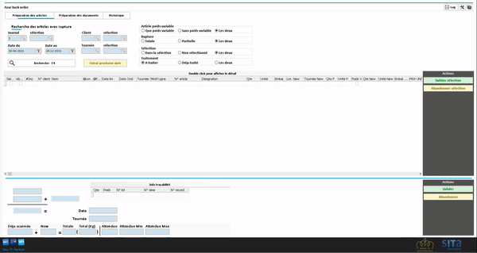

# Azur backorder

### Release note 

| Lien | Release note                                                               | Who | When       |
| ---- | -------------------------------------------------------------------------- | --- | ---------- |
|      | Version 1.0                                                                | MFI | 27.12.2021 |
|      | Version 1.1 ajout la possibilité de faire une commande par commande source | MFI | 11.03.2022 |

### Introduction 

Le proramme Azur back order, permet de regénérer des commandes clients. La génération de ces commandes se base sur la préparation des commandes et des ruptures.


Tip

Vous pouvez définir les règles de rupture depuis l'écran des options.


### Préparation des articles 

La première étape consiste à sélectionner les articles à repréparer.

Dans cet onglet, vous allez pouvoir sélectionner les articles et les quantités à repréparer. Si c'est possible, Azur va vous proposer la date de la futur commande en tennant compte des achats.

Pour sélectionner les articles à repréparer, vous diposez de plusieurs critères de recherche.

.png>)

.png>)

#### Actions 

**Valider sélection**

Vous faites confiance à la proposition, sélectionnez les lignes et cliquez sur "valider sélection", les lignes passeront en vert et seront disponibles à l'étape de préparation des documents.

**Abandonner sélection**

Vous ne voulez pas regénérer des commandes pour ces articles, sélectionnez les lignes et cliquez sur "Abandonner sélection"

**Valider**

Vous avez la possibilité de double cliquer sur une ligne. Azur vous affiche les quantités à repréparer. Si la proposition vous convient, cliquez sur "Valider".

**Abandonner**

Vous avez la possibilité de double cliquer sur une ligne. Azur vous affiche les quantités à repréparer. Si la proposition ne vous convient pas, cliquez sur "Abandonner"

### Préparation des documents 

Dans cet onglet, vous visualisez une dernière fois la liste des articles que vous avez sélectionné à l'étape de préparation des articles. La liste ne vous affiche que ce qui sera traité.

Cliquez sur le bouton "Générer documents" pour générer les nouvelles commandes.

.png>)

#### Grouper document 

Azur peut vous proposer de regrouper des documents en un seul. Par exemple, le client A doit encore recevoir 2 jambons et 1 carton de sauce tomate. La livraison des jambons est prévue lundi et la sauce tomate le mardi. Si vous souhaitez grouper les documents, Azur regénèra une seule commande avec la plus grande date estimée.

#### Reprendre Texte libre 

Si lors de la commande initiale, vous avez utilisé un texte libre\*, il pourra être repris dans la nouvelle commande.


Tip

Cette option est intéressante si votre client vous demande de mentionner une référence sur les documents que vous échangez avec lui.



Info

Le texte libre à recherche se configure dans l'écran des options.


#### Ajout concerne 

Si coché, la nouvelle commande contiendra une ligne avec la mention "Concerne commande n° ... du ..."

**Reprendre référence document**

Si coché, la nouvelle commande aura la même référence que la commande initiale.

#### Impression auto 

Si coché, la nouvelle commande sera automatiquement imprimée lors de sa création.


Info

N'oubliez pas de choisir l'imprimante (En bas de la liste des actions).


### Historique 

Dans l'historique, vous pouvez:

* La liste des différents traitements qui ont été effectués.
* Les documents source et destination par traitement.
* Visualiser les documents dans le 711
* Imprimer / Réimprimer les documents.
* Voir les documents (report).

.png>)

### Version 1.1 

Ajoute la possibilité de générer une commande par commande source.

.png>)

.png>)


Info

Vous pouvez configurer une valeur par défaut à cette case via l'écran des options.

