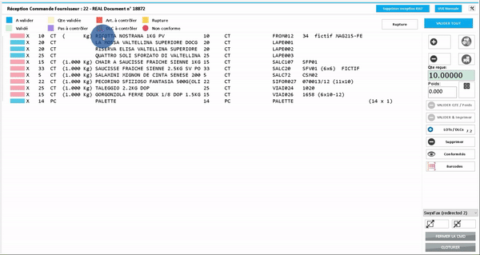

# Réception marchandise

### Release note <a href="#release-note" id="release-note"></a>


| Date         | Note                                         |
| ------------ | -------------------------------------------- |
| Octobre 2010 | MFI, modification de la saisie du lot et DLC |
| Juillet 2020 | MFI, création de l'écran de récpetion        |

### L'écran <a href="#lecran" id="lecran"></a>

L'écran de la réception de marchandise propose deux vues.

* Vue normale
* Vue simple

#### Vue normale <a href="#vue-normale" id="vue-normale"></a>

À l'ouverture de l'écran via le menu, il se présente dans sa vue normale.

.png>)

Ici, la partie importante est l'entête. Ici l'utilisateur peut rechercher une commande et l'ouvrir. _Voir ci-dessous comment ouvrir une commande dans ce chapitre_

#### Vue simple <a href="#vue-simple" id="vue-simple"></a>

.png>)

L'écran de la réception de marchandises propose les fonctions suivantes:

* Valider la quantité
* Valider un article et imprimer une étiquette
* Saisir un lot fournisseur (ou même la DLC, en cas de denrées périssables)
* Validation de la conformité

La **vue normale** offre un procédé de réception de marchandise un petit peu différent que la _vue simple_.

**Légende - codes couleur**

.png>)

Pour avoir une bonne vue d'ensemble, cet écran utilise des codes couleurs décrits ci-dessus.

Il est donc possible de procéder par étapes. C'est-à-dire qu'un employé peut être affecté à différentes tâches ou simplement au contrôle de la conformité.

| Statut               | Description / Remarque                                                                                                                                                                                                                       |
| -------------------- | -------------------------------------------------------------------------------------------------------------------------------------------------------------------------------------------------------------------------------------------- |
| **À valider**        | Ligne article non traitée                                                                                                                                                                                                                    |
| **Validé**           | Ligne article traitée                                                                                                                                                                                                                        |
| **Qté validée**      | La quantité a été contrôlée et validée (qu'elle soit complète ou pas). Si la réception marchandise est faite par plusieurs personnes, la prochaine personne doit remplir les autres paramètres et valider la ligne de l'article.             |
| **Pas à contrôler**  | L'article ne nécessite pas de contrôle.                                                                                                                                                                                                      |
| **Art. à contrôler** | Vérification de l'article nécessaire                                                                                                                                                                                                         |
| **DLC à contrôler**  | Pour les articles nécessitant un suivi de leur DLC, une étape et un statut spécifique sont prévus pour séparer les opérations.                                                                                                               |
| **Rupture**          | L'article n'a pas été reçu dans sa quantité commandée et ne fera pas l'objet d'une nouvelle livraison. L'utilisateur a donc appuyé sur le bouton _Rupture_ pour signaler que la commande peut être clôturée même sans la quantité manquante. |
| **Non conforme**     | Les paramètres de conformité mentionne au moins un aspect qui ne respecte pas la qualité attendue.                                                                                                                                           |

Ce chapitre va passer en revue la marche à suivre pour une réception marchandise complète ou partielle.

### Ouvrir une commande <a href="#ouvrir-une-commande" id="ouvrir-une-commande"></a>

#### Avec F3 <a href="#avec-f3" id="avec-f3"></a>

L'utilisateur a la possibilité de rechercher la commande à l'aide des champs ci-dessous.

Ces champs de recherche peuvent être utilisés individuellement ou combinés les uns aux autres.

.png>)

Avec les fenêtres de recherche _F3_ l'utilisateur peut accéder aux fournisseurs dans le champ _N° Four_, aux commandes dans le champ _N° cmde_.

#### Avec code barre <a href="#avec-code-barre" id="avec-code-barre"></a>

* Vous pouvez charger une commande en scannant un code barre.


Tip

Vous pouvez imprimer un report avec la liste des livraisons du jour. Par exemple le report n° 313201.


.png>)

Après avoir sélectionné une commande, Azur ouvre celle-ci dans le mode _vue simple_. Cette vue est plus ergonomique, car l'écran n'est pas rempli avec des informations qui ne sont peut-être pas nécessaire au processus de réception. Néanmoins, il est possible de changer la vue grâce au bouton _vue normale_ en haut à droite de l'écran.


Tip

Il est possible de changer la vue à tout moment lors du traitement d'une réception marchandise.

.png>).png>)


### Saisir la quantité reçue <a href="#saisir-la-quantite-recue" id="saisir-la-quantite-recue"></a>

.png>)

Les articles de la commande sont à contrôler lors de la réception de la commande. Le contrôle des quantités permet de déterminer quelle sera la suite de la commande dans le processus (commande clôturée / commande fermée pour être reprise ultérieurement).

#### Comment saisir la quantité? <a href="#comment-saisir-la-quantite" id="comment-saisir-la-quantite"></a>

La saisie des quantités se fait en cliquant dans la case _Qté reçue_. Une fenêtre de type calculatrice s'affichera et l'utilisateur peut alors taper le nombre exact reçu. Il est également possible d'utiliser les boutons **+** et **-** . L'écran est également utilisable en mode _tablette_.

.png>).png>)


Warning

Si un article n'a pas été livré dans la quantité commandée et que le fournisseur informe le responsable achat ou l'opérateur de réception que l'article n'est plus disponible, l'utilisateur peut alors:


1. Reprendre la commande
2. Sélectionner l'article en question
3.  Cliquer sur le bouton _Rupture_ en haut de l'écran

    Le code couleur du statut de l'article s'affichera alors en jaune.

.png>)


#### Article sans contrôle de la DLC <a href="#article-sans-controle-de-la-dlc" id="article-sans-controle-de-la-dlc"></a>

Pour les articles sans contrôle de la DLC, vous pouvez valider/Imprimer dirrectement l'article.




Info

Pour qu'un article soit avec contrôle de la DLC, il faut que ARTICLE.CONTROLE\_DLC soit "T"


#### Article avec contrôle de la DLC <a href="#article-avec-controle-de-la-dlc" id="article-avec-controle-de-la-dlc"></a>

Pour les articles avec contrôle de la DLC, il n'est pas possible de valider et d'imprimer dirrectement l'article.

Pour ces articles:

* il faut utiliser le bouton 
* Saisir la quantité, le lot et la DLC (le poids est facultatif) et valider

.png>)

.gif>)


Info

* Par défaut la quantité affichée est la quantité qu'il reste à réceptionner.
* Vous pouvez utiliser le bouton "DLC" pour saisir la dlc via le calendrier.


#### Lots fournisseur et DLC <a href="#lots-fournisseur-et-dlc" id="lots-fournisseur-et-dlc"></a>

.png>)

Dans le cadre d'une même livraison, il se peut que le fournisseur livre une quantité d'articles sous le même numéro de lot ou bien en mentionnant différents lots. Afin de garder une trace de ces lots, Azur permet de le(s) saisir via le bouton _LOTs/DLCs_.

Pour ce faire:

* Cliquer sur le bouton _LOTs/DLCs_ - une fenêtre de saisie s'ouvrira
* Saisir le n° de lot
* Cliquer sur le bouton _Ajouter_ pour ajouter un autre lot fournisseur
* Cliquer sur _Valider_ pour enregistrer


Important

Cette fenêtre permet aussi de saisir la Date Limite de Consommation (DLC) en cas de livraison de denrées périssable ou autres articles ayant une DLC.

Pour ce faire, il suffit de suivre **les mêmes étapes** que mentionnées ci-dessus. Certains articles faisant partie du même lot, la DLC peut alors être saisie en même temps (dans la même ligne) que le lot fournisseur.


Il est aussi possible de **modifier** et **supprimer** des enregistrements dans cette fenêtre de saisie. Il suffira à l'utilisateur de cliquer sur les boutons respectifs.

#### Article avec multi palette <a href="#article-avec-multi-palette" id="article-avec-multi-palette"></a>

Par défaut Azur fait une conversion des articles à réceptionner pour les afficher par palette.


Info

Par exemple, vous avez commandé 100 cartons de vin et dans Azur, vous avez configuré qu'une pallette de vin se compose de 50 cartons, dans ce cas, lors du chargement de la commande, le vin sera représenté sur 2 lignes à receptionner.



#### Code barre <a href="#code-barre" id="code-barre"></a>

**Code barre Article**

Lors de la vérification d'un code barre scanné, Azur va vérifier si le code barre correspond à l'un de ces champs

* ARTICLE.CODE\_BARCODE
* ARTICLE.CODE\_BARCODE\_PALETTE
* ARTICLE.CODE\_BARCODE\_FOURNISSEUR
* ARTICLE.CODE\_BARCODE\_CARTON
* ARTICLE.NO\_ARTICLE

Si un article est trouvé, Azur va essayer de se positionner sur la ligne correspondante, si dans la commande il n'y a pas l'article trouvé, Azur vous affichera un message.

**Code barre GS1**

Si-dessous une explication du déroulement du décode GS1 Si Azur n'a pas trouvé d'article en décodant le code barre, il va vérifier si le code barre est de type GS1.

```
SELECT * FROM  BARCODE_DECODE_GS1(:NO_DOSSIER,9000,:BARCODE)
```

Azur décode les préfix 01 et 02 pour identifier l'article.

* 01, SSCC est la référence fournisseur
* 02, NUM\_OF\_CONTAINER est la référence fournisseur

Avec cette référence, Azur recherche le n° d'article avec la procédure R$GET\_ART\_AZUR\_FROM\_REFFOUR. Azur va vérifier si la référence fournisseur correspond à l'un des champs suivants

* ARTICLE\_UNITE\_CONVERSION.CODE\_BARCODE
* ARTICLE.CODE\_BARCODE
* ARTICLE.CODE\_BARCODE\_PALETTE
* ARTICLE.CODE\_BARCODE\_FOURNISSEUR
* ARTICLE.CODE\_BARCODE\_CARTON

Si l'article est trouvé et qu'il est présent dans la commande, le gs1 sera décodé comme ceci: - la Dlc = SELL\_BY\_DATE - le N° de lot = NO\_LOT - le poids = PRODUCT\_WEIGHT - la quantité = NUM\_OF\_UNIT


**Tip**

Pour les plus qualifiés:


* Je vous invite à regarder la procédure BARCODE\_DECODE\_GS1 et les DESCRIPTIONS\_DIVERSES.CODE=9000.
* En cas d'une mauvaise association Référence fournisseur Article azur, un enregistrement sera fait dans JOURNAL\_ACHAT\_SOCIETE\_208.PARAMETRES


### Impression des étiquettes <a href="#impression-des-etiquettes" id="impression-des-etiquettes"></a>

Si l'article est un article avec contrôle de la dlc, l'impression se fera une fois les lots/dlc saisis.

Si l'article est un article sans contrôle de la dlc, l'impression se fera une fois le clique sur VALIDER & imprimé fait.

#### Configuration des impressions <a href="#configuration-des-impressions" id="configuration-des-impressions"></a>

L'imprimante peut être configurée en fonction de l'étiquette et de l'empl**a**cement de l'article.


Info

Cette configuration se fait via le point 57.Imprimante en fonction de l'emplacement dans l'onglet 1.Paramètres de l'écran des options traçabilité.


### Les paramètres de conformité <a href="#les-parametres-de-conformite" id="les-parametres-de-conformite"></a>

.png>)

Le processus de réception des marchandises prévoit également la possibilité de saisir l'état de qualité des articles livrés. Cette évaluation peut se faire sur plusieurs critères:

* le packaging
* les informations sur l'étiquette
* la température \*(pour les denrées périssables)
* la langue sur l'étiquette
* l'état du produit
* la référence

En fonction des critères en vigueur au sein de l'entreprise, l'utilisateur pourra accepter ou non la livraison.

Pour saisir la conformité, il suffit de:

* Cliquer sur le bouton _Conformités_ - une fenêtre de saisie s'ouvrira
* Cliquer sur les boutons de critères en jaune

Les boutons changeront de couleur en _vert_ et auront la mention " OK " qui s'ajoute à l'intitulé du bouton.

* Cliquer sur le bouton _Valider_ pour enregistrer.


Info

La saisie de la conformité n'est pas obligatoire. Ces informations sont purement à titre d'information. Le processus actuel permet la réception de marchandise sans paramètres de conformité sans que cela bloque les opérations. Les confirmités sont variables et peuvent être configurées depuis l'écran des options.


#### La réception partielle <a href="#la-reception-partielle" id="la-reception-partielle"></a>

Pour la saisie d'une réception partielle il faut procéder comme suit:

1. Rechercher la commande
2. Sélectionner la commande
3. Saisir les paramètres de conformité (**si besoin**)
4. Saisir le n° de lot du fournisseur et / ou la DLC (**si besoin**)
5. Cliquer sur la ligne de l'article à réceptionner
6. Saisir la quantité reçue de l'article sélectionné
7. Cliquer sur _Valider & Imprimer_
8. Répéter les étapes **1** à **7** pour tous les articles de la commande

Après avoir passé en revue les articles reçus et encodés leur quantité (partielle ou complète), il suffit de cliquer sur le bouton _Fermer la CMD_.

**Azur** va alors générer 4 messages de confirmation pour pouvoir effectuer les actions correspondantes:

**Êtes-vous sûr de vouloir fermer la commande?**


| Réponse | Action d'Azur                                                      |
| ------- | ------------------------------------------------------------------ |
| **Oui** | La commande va être fermée mais non clôturée.                      |
| _Non_   | La commande reste ouverte à l'écran pour continuer les opérations. |

**Voulez-vous clôturer la commande ?**


| Réponse | Action d'Azur                                                                                                                                                                |
| ------- | ---------------------------------------------------------------------------------------------------------------------------------------------------------------------------- |
| **Non** | La commande, qui n'est pas complète, va rester ouverte et **reste en étape no. 12**. L'OA est également disponible à l'étape intermédiaire no. 98 **Avis d'entrée partiel**. |
| _Oui_   | La commande va être clôturer et l'O.A. **va passer à l'étape no. 13**.                                                                                                       |

**Voulez-vous envoyer une notification au demandeur?**


| Réponse | Action d'Azur                                                                                                  |
| ------- | -------------------------------------------------------------------------------------------------------------- |
| **Oui** | Un email sera envoyé au demandeur qui lui va pouvoir consulter son avis d'entrée partiel via le bouton du DMS. |
| _Non_   | Email non envoyé - le demandeur ne sera pas informé de l'état actuel de la réception partielle.                |

**Voulez-vous voir un aperçu de l'avis d'entrée partiel ?**


| Réponse | Action d'Azur                                                                                                                                                                                                                                                            |
| ------- | ------------------------------------------------------------------------------------------------------------------------------------------------------------------------------------------------------------------------------------------------------------------------ |
| **Oui** | Azur va afficher le document. Les lignes partielles seront affichées en gris, de façon à se différencier des articles complètement réceptionnés ou n'ayant pas de réception du tout. L'utilisateur peut imprimer / sauvegarder le document à partir de cet aperçu aussi. |
| _Non_   | Le document ne sera pas affiché. Il sera simplement ajouté au DMS.                                                                                                                                                                                                       |


**Important**

Les réponses ci-dessus marquées en **gras** sont les réponses à mettre aux questions d'Azur pour bien compléter les actions du workflow.


**L'avis d'entrée partiel**

L'avis d'entrée partiel met bien en évidence les quantités reçues et restantes à livrer. Chaque article faisant l'objet d'une livraison partielle y sera indiquée avec les quantités reçues et la date/heure de réception ainsi que la personne ayant fait la réception.

.png>)

**Comment saisir une livraison supplémentaire?**

Dans le cas d'une livraison partielle, il se peut qu'un ou plusieurs articles n'aient pas été livrés ou que le fournisseur n'ayant pas fourni toute la quantité commandée livre alors un article pour compléter cette quantité commandée, c'est-à-dire la **N**-ème livraison de l'article.


Important

Toute réception doit être saisie comme décrit ci-dessus.

Ci-dessous, la description du processus de saisie d'une livraison supplémentaire d'un article est intentionellement abrégée. Ceci afin de bien mettre l'accent sur le procédé de saisie d'une **N**-ème livraison d'un article incomplet.


Voyons le scénario suivant:

**1ère** livraison:

* Article : GANTS HYCRON ANSELL T10 Quantité livrée: 2
* Saisie de la quantité dans le champs _Qté reçue_

.png>)

La vue des articles se présente alors comme suit:

.png>)

L'utilisateur ferme alors la commande et attend d'être livrée du reste de la commande.

**2ème** livraison:

* Article : GANTS HYCRON ANSELL T10 Quantité livrée: 3

Pour la saisie de la quantité:

* Cliquer sur le bouton 
* Azur demande alors de saisir la quantité reçue

.png>)

* Après la saisie de la quantité reçue, Azur va créer une deuxième ligne de réception, visible dans l'arborescence de l'O.A.

.png>)

Il ne reste plus qu'à valider la quantité avec le bouton _Valider & imprimer_.


Feature

Azur sait aussi reconnaître si la quantité reçue est supérieur à celle commandée. Un message demandera alors à l'utilisateur s'il veut mettre à jour le delta.

.png>)

Avec un clic sur _Oui/Yes_ la ligne principale de l'article sur l'O.A. est mise à jour et reflète le total de la quantité réceptionnée.




.png>)

Ce procédé permet une bien meilleure visibilité des différentes livraisons d'un article et trace les différentes étapes de livraisons partielles. Chaque livraison partielle correspondant à un Avis d'entrée, l'utilisateur peut après alors comparer et confirmer correctement les documents dans le DMS aux quantités livrées.

**Informations complémentaires / Particularités**


| Étape                  | Remarque                                                                                                                                                                                                                      |
| ---------------------- | ----------------------------------------------------------------------------------------------------------------------------------------------------------------------------------------------------------------------------- |
| **Recherche commande** | Peut se faire à l'aide des champs _N° four._ et / ou _N°Cmde_                                                                                                                                                                 |
| **Conformité**         | Il n'est pas obligatoire de saisir ces paramètres afin de compléter la réception. Cette étape peut servir de baromètre de qualité à la livraison en case d'émission d'un bon de retour.                                       |
| **Lot fournisseur**    | Si le fournisseur mentionne ces informations, celles-ci peuvent être inscrites à ce moment-là.                                                                                                                                |
| **Quantité reçue**     | Dans le cas d'une réception partielle, par définition, celle-ci est inférieure à la quantité de la commande. Elle peut alors être modifié ici.                                                                                |
| **Valider & Imprimer** | Cette étape valide la réception de l'article. Azur peut être configuré pour qu'une étiquette soit imprimée. Cette impression n'est pas obligatoire et se définira en fonction de l'organisation en vigueur dans l'entreprise. |

**Saisie de la réception en vue normale**

Les étapes de saisie pour la réceptions sont les mêmes dans la _vue simple_ et dans la _vue normale_.

La différence est que la **vue normale**, propose une suite guidée des opérations.

**Étape 1** : L'écran demande la saisie des informations de conformité.

.png>)

Dans un contexte, où le processus de l'entreprise ne requière pas obligatoirement la saisie de ces informations, l'utilisateur peut sauter à l'étape 2 directement.

**Étape 2** : L'écran demande la saisie des informations de lots fournisseur, quantités, DLC et poids. Comme dans la vue simple, ces données ne sont pas obligatoires, mis à part la quantité.

.png>)

Après cette saisie, l'utilisateur peut valider la réception de l'article en cliquant sur _Valider_.

.png>)


Attention

**Étape 3** : Cette étape est totalement **facultative**. Il s'agit ici d'une saisie d'informations relatives aux denrées alimentaires pour une entreprise dans ce secteur d'activité.


#### La réception complète <a href="#la-reception-complete" id="la-reception-complete"></a>

Tout comme pour une réception partielle, les étapes sont:


1. Rechercher la commande
2. Sélectionner la commande
3. Saisir les paramètres dec conformité (**si besoin**)
4. Saisir le n° de lot du fournisseur et / ou la DLC (**si besoin**)
5. Cliquer sur la ligne de l'article à réceptionner
6. Valider la quantité en cliquant sur _Valider Qte_ (**étape facultative** - utile que si 1 personne réceptionne la marchandise et une autre confirme la réception)
7. Cliquer sur _Valider & Imprimer_
8. Répeter les étapes **1** à **7** pour tous les articles de la commande

**Particularités**

.png>)

L'étape **6** n'est pas obligatoire, car si la quantité reçue est égale à celle commandée, l'article peut être validé de suite. La valeur dans le champ _Qte reçue_ est remplie avec le nombre présent sur la commande.


**Tip**

Il est possible de **valider** tous les articles d'une commande en 1 seule action. Habituellement, cette fonction est utilisée quand le contrôle de toute la marchandise est faite en une seule fois et que toute les quantités correspondent à la commande.

**Attention** le statut de chaque article passera ainsi en **Validé** !

.png>)


**Suppression d'une ligne de réception**

Quand l'utilisateur a commit une erreur lors de la saisie de la quantité d'un article ou d'une autre donnée, il est possible de supprimer cette ligne. Pour cela:

* Sélectionner la ligne en question
* Cliquer sur le bouton **Supprimer**

Cette action va supprimer la ligne de réception et l'utilisateur peut alors refaire la réception de cet article.

.png>)

#### Clôture de la commande <a href="#cloture-de-la-commande" id="cloture-de-la-commande"></a>

Après avoir terminé la réception de la marchandise, l'utilisateur peut cliquer sur le bouton _Clôturer_. Azur va alors créer les mouvements de stock pour enregistrer les articles.

À la demande de confirmation si Azur doit clôturer la commande, cliquer sur _Oui" (_&#x59;es\*)

.png>)

Azur demande l'utilisateur s'il désire voir l'aperçu du document de réception. En cliquant _Oui_ (_Yes_), l'avis d'entrée est affiché à l'écran.

Azur confirme alors la validation de la réception.

.png>)

L'avis d'entrée est alors affiché. L'utilisateur peut alors l'envoyer par email ou l'imprimer en utilisant les boutons de la toolbar ou par le menu clic-droit sur le thumbnail du document.

Ci-dessous un exemple de l'avis d'entrée pour une réception complète.

.png>)

Un avis d'entrée doit passer par **3** étapes dans le workflow.

*   Étape no. **12** : Réception marchadise

    _Création de l'avis d'entrée et insertion du nom et de la date & de l'heure de la réception_
*   Étape no. **13** : Validation de l'avis d'entrée par le demandeur

    _Insertion du nom et de la date & de l'heure de la validation._
*   Étape no. **16** : Évaluation du fournisseur par le responsable achat

    _Insertion du nom et de la date et de l'heure sur l'avis d'entrée._

À chacune de ces étapes l'avis d'entrée est inséré dans le DMS et devient consultable à tout moment.

Il suffit de double cliquer sur une ligne pour ouvrir l'aperçu du document sauvegardé dans le DMS.


**Note**

Pour information, l'utilisation des étapes est propre à chaque client. Il se peut que chez vous, les étapes soient différentes ou simplement pas utilisées.



**Note**

Lors d'une **réception partielle**, l'avis d'entrée montre la quantité livrée et la quantité restante en fonction des données saisies. Lors d'une **réception complète**, l'avis d'entrée affiche 0 dans le champ _Reste à livrer_.



**Note**

Il est important de noter que les utilisateurs peuvent attacher tout type de document au DMS d'Azur. Le contenu d'un ordre d'achat dans le DMS sera donc composé de documents attachés par l'utilisateur et de documents créés et sauvegardés par **Azur ERP**. Un O.A. peut donc être associé à divers fichiers (pdf, format Microsoft Office, Audio, Video, images et bien d'autres...)

