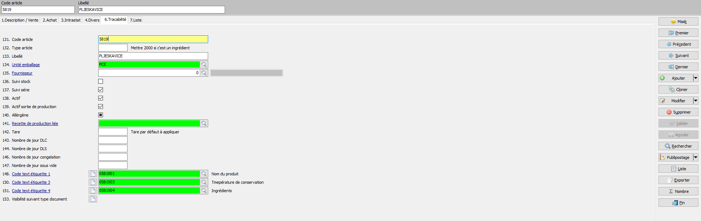

# Production-Traçabilité

### **Réception Commande Fournisseur**

Après avoir créé notre bon de commande sur le menu azur 721 (_Document D'achat_), nous passons à la phase de réception des commandes _3R3_, c'est la première étape du module _Production:_

Dans l'écran de réception, nous entrons le numéro du fournisseur et le numéro de la commande que nous voulons traiter, automatiquement les lignes de la commande saisie apparaîtront à l'écran, à partir de ce moment nous sommes prêts à traiter les lignes en les sélectionnant sur le panneau Azur soit en scannant les codes-barres directement sur les produits.&#x20;

Par la suite Azur nous demandera de renseigner quelques champs fondamentaux pour la création de la traçabilité et du stock produit : (photo ci-dessous)

Une fois le produit à traiter sélectionné, il est nécessaire de fournir quelques informations :

* _Conformité_ du produit, de l'aspect de l'intégrité de l'emballage,de l'étiquette, du véhicule et de chauffer, (ces paramètres sont renseignés de manière standard pour accélérer le processus) ;
* _Texte,_ lorsque le produit ne répond pas aux attentes en cliquant sur retour vous pouvez automatiquement créer le retour en précisant le motif, sinon le champ texte reste vide et vous continuez ;
* _DLC,_ dans ce champ vous devez entrer les données d'expiration et la température de stockage;&#x20;
* _N°lot Fournisseur,_ entrez le numéro de lot de production ;
* _QTE et Poids,_&#x65;ntrez la quantité et le poids du produit reçu.

* _Pays de naissance, Pays d'elevage, Pays de découpe,Pays d'abbatage,_ un clic sur la loupe ou sur F 3 ouvrira une liste avec tous les pays du monde afin qu'ils puissent figurer dans les informations relatives à l'origine du produit ;
* _Frigo,_ choisir le frigo (loupe ou F3) dans lequel stocker le produit reçeptionee.

Une fois que vous avez complété ces informations en cliquant sur le bouton _Valider_ situé en bas à gauche de l'écran, la rangée du produit transformé deviendra verte en passant à la rangée suivante (photo ci-dessous)


`ATT:`

`la couleur bleue indique la ligne qui est en cours de traitement, les rouges représentent celles qui doivent encore être traitées.`


Lorsque nous avons reçu tous les produits en Azur, nous nous déplaçons à droite de l'écran où nous cliquons sur _Terminer_ pour valider la commande, photo ci-dessous

Grâce à ce menu, nous pouvons également apporter d'autres modifications à la commande et également accéder aux paramètres généraux de l'écran et des appareils qui y sont connectés (balances et imprimantes).

### **Création et Gestion de Recettes et des Articles.**

Via le menu 73 nous avons la possibilité de créer et gérer des articles dans Azur

`NB` se référer à la doc[#creation-articles](../ecosysteme-azur/azur.md#creation-articles "mention").

après avoir vu comment configurer les articles "simples", passons à la création des articles auxquels nous associerons une recette de production. Le menu que nous utiliserons sera _73C Traitement des Articles._&#x20;

le menu 73C est le même que le menu 731 traditionnel, même principe de fonctionnement et même aspect, la seule différence réside dans les onglets traditionnels en haut, auxquels s'ajoute le suivi des 6 onglets Tracabilité : (photo ci-dessous)

`en` plus des champs traditionnels pour la création ou la gestion (**NB** &#x71;_&#x75;and on parle de gestion d'un article on entend configurer un article simple déjà existant comme article de production auquel on associera une recette)_ d'un article :

* **champ&#x20;**_**131** Code article;_
* **champ** _**133** Libellé (nom article)_
* **champ&#x20;**_**134** Unité emballage article_&#x20;

nous devons renseigner les champs suivants pour créer un article de production avec traçabilité :

* **champ** _**132** Type article,_ que dans le cas d'un article de production on laissera vide alors que s'il s'agit d'un article (ingrédient) d'une recette on devra compléter avec un paramètre standard=200&#x30;_;_
* **champ&#x20;**_**137** Suivi serie et_ **champ** _139 Actif sorti de production,_ ils doivent toujours être cochés afin que nous ayons une traçabilité correcte des produits utilisés dans la production;
* **champ** _**148,150,151** Code text étiquette,_ il y a 3 champs à chacun desquels on associe les étiquettes qui contiendront : nom du produit, température de conservation et description de la recette.

Quant à la configuration des étiquettes si elles n'existent pas, elles doivent être créées via le menu _Traitement de texte 3k1_ : (photo ci-dessous)

le principe de fonctionnement de l'écran est le même que les autres menus de création d'articles, à droite on retrouve un menu à travers lequel on peut ajouter ou cloner une étiquette déjà existante :

* **champ 1** _Code formulaire_ : F( texte pour les factures)-R(texte pour les rappels)-E(texte pour les etiquettes), en remplissant le champ avec l'un de ces trois paramètres, nous choisirons le type de formulaire que nous créerons ;
* **champ 2** _Code Texte,_ nous créons un code numérique ou alphanumérique unique afin que nous puissions associer notre étiquette à l'article que nous allons produire ;
* **champ 3** _Libelle texte,_ dans ce champ, nous laissons le paramètre standard : NOM\_ARTICLE\_ETIQ;
* **champ** **4-5-6** _Texte en Allemand/Francaise/Anglais/,_ en cliquant dans le champ de la langue par laquelle nous voulons décrire notre étiquette, l'écran suivant s'ouvrira (photo ci-dessous) où nous pourrons ajouter toutes les informations que nous voulons imprimer sur l'étiquette.

### **Gestion des Recettes**&#x20;

_Menu 738_ c'est ce qu'il affiche sur Azur pour créer ou gérer les recettes de fabrication des articles : (photo ci-dessous)

avant de procéder à l'insertion des ingrédients de production, composons l'étiquette de production qui, en plus des ingrédients, contiendra les informations essentielles pour la traçabilité, la gestion et la conservation du produit. En utilisant le haut de l'écran, nous pouvons modifier cloner une recette existante ou en créer une nouvelle :

* premier champ à renseigner est le champ _**Désignation**_, c'est-à-dire donner un titre à notre production ;
* _**Article 2**_**,** à travers la loupe ou en cliquant sur f3 Azur lancera un aperçu où il est possible de choisir l'article de production (article que nous avons déjà créé dans le menu 73C) ;
* _**Poids/Qte-Unité**_ sont les champs dans lesquels entrer le type d'unité que nous utiliserons pour la production (kg, Pce), et la quantité de chaque production individuelle ;
* _**Tolérance en %**,_ ce champ représente en pourcentage la quantité variable d'ingrédients que le programme peut accepter pour la préparation de la recette ;
* _**Nb.DLS-DLC,**_ indiquer les jours limités dans la durée de conservation du produit et la durée de consommation ;
* _Température ,_ le dernier champ est la température de stockage du produit fin&#x69;_._

Une fois la recette validée, en cliquant sur le bouton _**Valider,**_ on saisit nos ingrédients qui composent la recette en se déplaçant automatiquement en bas de l'écran :

* _**Ingredient**,_ sélectionner l'article que nous avons l'intention d'ajouter dans notre recette ;
* _**Poids/Qte-Unité**,_ la quantité de l'article qui doit être ajoutée à la recette
* _**Ingredient Alternatif**_, nous avons la possibilité de sélectionner un article pouvant remplacer le premier article en cas de rupture de stock ;

`Nb:`en plus des champs sélectionnés jusqu'à présent, nous pouvons configurer davantage nos ingrédients grâce à certains champs en bas à droite de l'écran, à travers lesquels nous pouvons gérer les produits comme un allergène par exemple ou non quantifiable afin de ne pas rester bloqué au moment de la fabrication du produit fini.

### **Production Découpe et Emballage&#x20;**_**3RN**_

#### **Production**

après avoir lance du menu 3RN et connexion avec votre utilisateur, nous allez choisir le type d'activité à faire via l'écran dynamique sur AZUR, nous avons 3 choix : production, découpe et embalage. L'écran de production est ce que nous allons utiliser pour préparer les articles avec recette, mais nous pouvons aussi les produire sans nécessairement suivre une recette. : (photo ci-dessous)

Une fois que nous avons choisi notre méthode de production avec recette par exemple, Azur nous montrera un aperçu des articles afin que nous puissions choisir lequel travailler et combien de productions nous avons l'intention de faire, ou disons : ex. une fois la production du produit X, Azur va calculer le poids de chaque ingrédient à ajouter à la recette (voir écran _738, gestion des recettes_) pour que le produit soit équilibré : (photo ci-dessous)

Azur nous guidera dans le choix de tous les ingrédients et leur juste poids selon la recette, sinon le programme ne nous donnera pas la possibilité de continuer notre production et nous donnera également la possibilité si l'article choisi n'est pas présent dans notre stock de _'passer l'ingrédient'_ s'il fait partie des articles liés à un article facultatif.

Après la saisie des ingrédients nous pouvions imprimer notre étiquette de production avec toutes les informations nécessaires à la traçabilité et aussi nous choisissons l'endroit où stocker le produit fini : (photo ci-dessous).

#### Découpe&#x20;

L'écran de découpe est divisé en deux parties : Découpe libre ou Découpe guidée (photo ci-dessous).

Alors que pour le _Découpe guidée_, nous devons créer une configuration qui nous accompagnera tout au long du processus, au lieu de cela, le _Découpe_ _libre_ nous permet de choisir le produit fini que nous allons utiliser dans notre découpage: (photo ci-dessous).

En cliquant sur le bouton 'choix du produit fini', à travers l'apercu d'une liste d'articles nous pouvons choisir le produit fini que nous allons traiter. Donc à ce stade nous allons choisir la pièce  découpée que nous ajouterons à notre production : (photo ci-dessous).

à travers l'écran suivant on ajoute via scan du code barre ou en le recherchant par le + présent à l'écran toutes les pièces que l'on ajoutera à notre decoupe libre, une fois que tout est fini on valide notre decoupe : (photo ci-dessous).

#### Emballage&#x20;

L'ecran d'emballage fonctionne de la même manière que celui de production, cliquer sur _'Emballage_ et apres _Démarrer embalage_ azur nous donnera la possibilité de choisir (apercu article) le produit fini que nous comptons traiter dans notre production d'emballage&#x20;

L'écran qui s'ouvrira sera le suivant : (photo ci-dessous)

dans cet écran nous avons plusieurs paramètres à compléter :

* _Choix du produit à emballer_ : choix de l'article ;
* _Choix du conitionnement :_ ex. barquette plastique;
* &#x20;_Choix du gaz_&#x20;
* Entrer la quantité et la date d'emballage.

renseigné tous ces paramètres Azur vas generer une étiquette avec toutes les informations nécessaires.

`NB` dans l'écran 3RN, en plus des trois phases décrites (&#x70;_&#x72;oduction, découpage, emballage_), on peut aussi créer une charge, associer un lot à une production, imprimer des étiquettes grâce aux ongles situés au centre de l'écran : (photo ci -dessous).

